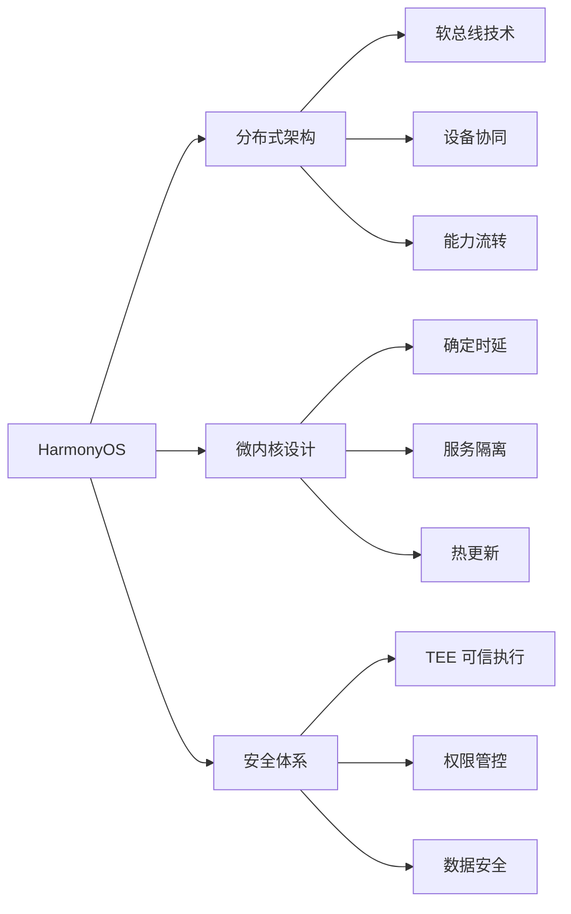
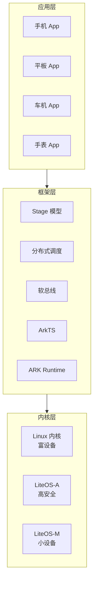
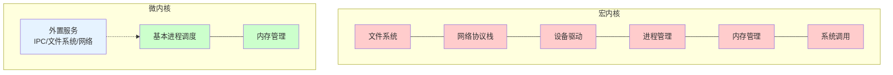
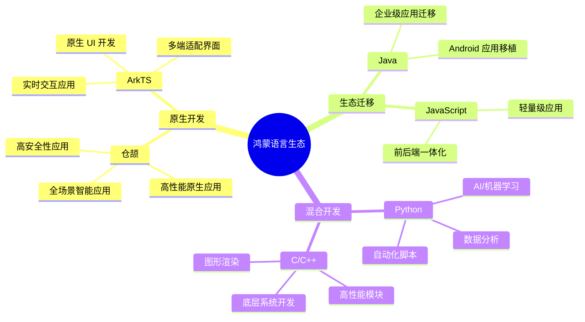
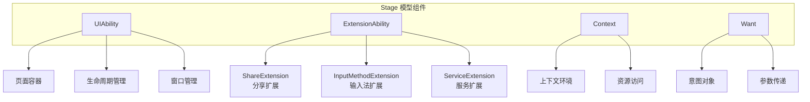
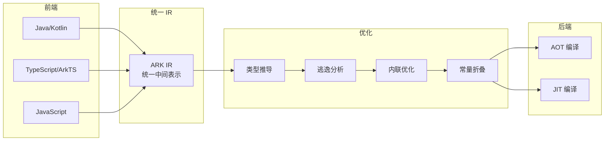
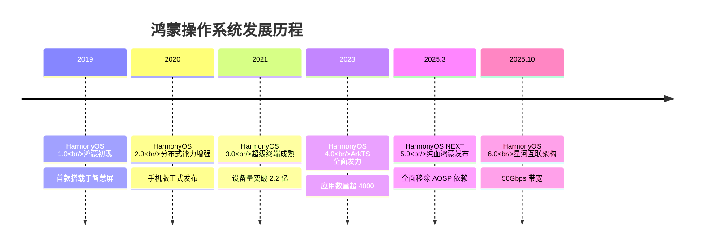
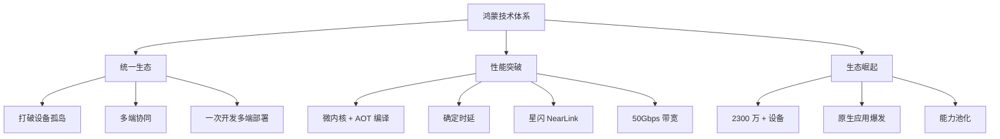

# HarmonyOS 核心技术与架构深度解析 | 2026 最新版

> 从资深程序员视角，系统性解读纯血鸿蒙的技术底座与开发范式

---

## 前言：为什么需要理解鸿蒙？

2025 年 3 月 20 日，华为正式发布**HarmonyOS NEXT（纯血鸿蒙）5.0 正式版**，全面移除 AOSP 依赖，标志着鸿蒙操作系统正式进入完全自主可控的新时代。2025 年 10 月，HarmonyOS 6.0 开发者 Beta 版发布，带来星河互联架构、50Gbps 分布式带宽、能力池化等革命性技术。

对于开发者而言，鸿蒙不仅是一个新的操作系统，更是一次**技术栈重构的历史性机遇**。本文将从技术底层出发，深度解析鸿蒙的核心架构、开发语言、应用模型与 AI 能力，帮助你快速建立对鸿蒙技术体系的系统性认知。

---

## 一、系统概述：鸿蒙的设计哲学

### 1.1 核心定位

鸿蒙操作系统的终极目标可以概括为八个字：**"统一生态，跨设备协同"**。

通过分布式架构设计，鸿蒙实现了**一套代码可运行在手机、平板、车机、智能手表、IoT 设备等多元终端**。这种"一次开发，多端部署"的能力，从根本上打破了传统操作系统的设备孤岛问题。

### 1.2 三大核心优势



**性能优势**：
- 微内核架构大幅提升系统安全性与确定性时延
- 轻量化内核 + 方舟编译器 + AOT 编译实现高效开发
- 内核代码量仅为 Linux 的 1/20，启动速度提升 50%

**安全体系**：
- 基于 TEE（可信执行环境）的 Security Foundation
- 实现数据安全、权限管控、设备认证的体系化保障
- 纯血鸿蒙采用全新安全架构，权限管控更加精细化

### 1.3 系统架构概览



---

## 二、微内核架构：与宏内核的深度对比

### 2.1 什么是微内核？

传统操作系统（如 Linux、FreeBSD）采用**宏内核（Monolithic Kernel）**架构，将文件系统、网络协议栈、设备驱动、进程管理、内存管理等核心功能全部集成在内核空间。

而鸿蒙采用**微内核（Microkernel）**架构，内核仅保留最基本的进程调度和内存管理功能，其他服务（如文件系统、网络、驱动）都运行在用户空间，通过 IPC（进程间通信）进行交互。

### 2.2 宏内核 vs 微内核



### 2.3 微内核的五大优势

| 特性 | 宏内核 (Linux) | 微内核 (HarmonyOS) |
|------|---------------|-------------------|
| 代码量 | 数千万行 | 数万行 (仅内核核心) |
| 安全隔离 | 进程级隔离 | 服务级隔离 + 权限管控 |
| 确定性时延 | 难以保证 | ✓ 硬实时支持 |
| 升级能力 | 需整系统升级 | ✓ 服务热更新 |
| 可靠性 | 内核崩溃则系统崩溃 | ✓ 服务故障隔离 |

### 2.4 鸿蒙内核分层设计

鸿蒙内核采用灵活的分层设计，支持多种内核类型适配不同设备场景：

```typescript
// 鸿蒙内核类型枚举
enum KernelType {
    KERNEL_LINUX,    // 智能手机、平板等富设备
    KERNEL_LITEA,    // 智能家居、汽车等高安全等级设备
    KERNEL_LITEM,    // 耳机、手表等轻量级设备
    KERNEL_VIRTUAL   // 虚拟化部署场景
}

// 内核配置结构
struct KernelConfig {
    uint32_t kernelType;
    bool enableMicroKernel;     // 微内核模式
    bool enable 确定性时延;     // 实时性保证
    uint32_t isolationLevel;    // 服务隔离级别
};
```

---

## 三、ArkTS 语言与星闪技术

### 3.1 ArkTS：TypeScript 的超集

**ArkTS** 是鸿蒙原生应用的主力开发语言，基于 TypeScript 扩展而来，完全兼容 TypeScript 语法，并增加了编译期静态类型检查能力。

**核心特性**：
- **静态类型安全**：编译期进行类型检查，确保运行时类型安全
- **声明式 UI**：通过 @State、@Link 等装饰器实现响应式编程
- **AOT 编译**：支持 Ahead-of-Time 编译，代码在安装时即编译为机器码
- **JIT 热点编译**：运行时动态优化热点代码，兼顾启动速度与峰值性能

### 3.2 ArkTS 状态管理示例

```typescript
// ArkTS 状态管理示例
import { State, Link, Prop } from '@ohos.arkui';

// 使用 @State 装饰器声明组件状态
@Component
struct Counter {
    // 状态变量 - 变化时触发 UI 重建
    @State count: number = 0;

    // 计算属性
    get doubleCount(): number {
        return this.count * 2;
    }

    @Builder
    build() {
        Column() {
            Text(`Count: ${this.count}`)
                .fontSize(30)

            Text(`Double: ${this.doubleCount}`)
                .fontSize(20)
                .fontColor(Color.Gray)

            Button('+1')
                .onClick(() => {
                    this.count++;
                })
        }
    }
}
```

### 3.3 ArkTS 并发编程

```typescript
// ArkTS 轻量级并发 - TaskPool
import { taskPool } from '@ohos.taskpool';

// 使用 @Concurrent 装饰器标记并发函数
@Concurrent
function processData(data: number[]): number {
    // 密集计算任务
    return data.reduce((sum, val) => sum + val, 0);
}

@Entry
struct MainPage {
    @State result: string = '';

    async onClick() {
        // 创建并发任务
        const task = new taskPool.Task(processData, [1, 2, 3, 4, 5]);

        // 提交到线程池执行
        const result = await taskPool.execute(task);

        this.result = `Sum: ${result}`;
    }
}
```

### 3.4 星闪 NearLink：革命性连接技术

**星闪（NearLink）**是鸿蒙核心短距离通信技术，性能远超传统蓝牙：

| 指标 | 蓝牙 5.0 | 星闪 NearLink |
|------|---------|--------------|
| 延迟 | 10-30ms | **20μs**（降低 500 倍） |
| 传输速率 | 2Mbps | **12Mbps** |
| 同步精度 | 10ms | **1ms 级** |
| 连接数 | 7 个 | **256 个** |

**应用场景**：智能车钥匙、工业传感器、无线音频、智能家居等。

---

## 四、编程语言支持：多语言生态

鸿蒙系统支持多种编程语言，满足不同开发场景需求：



### 4.1 仓颉语言：华为自研编程语言

**仓颉**是华为自主研发的编程语言，2025 年 7 月 30 日正式开源，支持运行时、编译器、命令行工具、标准库等完整工具链。

```cangjie
// 仓颉语言基础语法示例
module com.example.demo

import stdlib.io

// 主函数入口
public func main() {
    // 变量声明与类型推断
    let message: String = "Hello, HarmonyOS!"
    let count = 42  // 自动推断为 Int

    // 函数定义
    func greet(name: String) -> String {
        return "你好，\(name)！"
    }

    // 结构体定义
    struct Person {
        name: String
        age: Int32

        func introduce() {
            io.println("我是 \(name)，今年 \(age) 岁")
        }
    }

    // 使用示例
    let person = Person(name: "张三", age: 25)
    person.introduce()

    // 并发编程 - 轻量级线程
    go {
        io.println("后台任务执行中...")
    }
}
```

### 4.2 Python 鸿蒙开发示例

```python
# 鸿蒙 Python 开发示例
import harmony.ai as ai
import harmony.ui as ui

# AI 模型推理示例
def run_inference(image_path: str):
    # 加载盘古大模型
    model = ai.load_model("pangu-vision")
    
    # 图像识别
    result = model.predict(image_path)
    
    return {
        "label": result.label,
        "confidence": result.confidence
    }

# 数据分析示例
def analyze_data(data: list) -> dict:
    import numpy as np
    
    arr = np.array(data)
    
    return {
        "mean": np.mean(arr),
        "std": np.std(arr),
        "median": np.median(arr)
    }
```

### 4.3 C++ 鸿蒙开发示例

```cpp
// 鸿蒙 C++ 原生开发示例
#include <harmony/native.hpp>
#include <harmony/graphics.hpp>

using namespace harmony;

// 图形渲染引擎核心模块
class RenderEngine {
public:
    RenderEngine() {
        initGraphicsContext();
    }

    void render(Scene* scene) {
        // 渲染管线
        beginFrame();
        
        for (auto& obj : scene->objects) {
            drawObject(obj);
        }
        
        endFrame();
    }

    void drawObject(GameObject* obj) {
        // GPU 加速渲染
        m_graphics.drawMesh(obj->mesh);
        m_graphics.applyShader(obj->material);
    }

private:
    GraphicsContext m_graphics;
};

// 与 ArkTS 交互
extern "C" {
    void nativeInit() {
        // 初始化原生模块
    }

    int nativeProcess(const char* data) {
        // 处理来自 ArkTS 的数据
        return 0;
    }
}
```

---

## 五、Stage 模型：鸿蒙应用开发核心

### 5.1 Stage 模型概述

**Stage 模型**是鸿蒙应用的核心开发模型，相较于早期的 FA 模型，Stage 模型实现了**应用进程管理与 UI 渲染分离**，大幅提升了复杂应用的性能与稳定性。

### 5.2 四大组件



**UIAbility**：应用能力的抽象单元，相当于 Android 的 Activity。提供 UI 界面与用户交互，支持多实例与窗口形态。

**ExtensionAbility**：扩展能力框架，支持多种 Extension 类型，包括分享、输入法、服务等。

### 5.3 UIAbility 生命周期

```typescript
// UIAbility 生命周期
import { UIAbility, AbilityLifecycleCallback } from '@ohos.app.ability.common';

class MyAbility extends UIAbility {

    // ① 应用首次启动时触发
    onCreate(want: Want): void {
        console.log('Ability onCreate');
    }

    // ② Ability 窗口创建完成
    onWindowStageCreate(windowStage: WindowStage): void {
        // 加载主页面
        windowStage.loadContent('pages/MainPage');
    }

    // ③ Ability 进入前台
    onForeground(): void {
        console.log('Ability onForeground');
    }

    // ④ Ability 进入后台
    onBackground(): void {
        console.log('Ability onBackground');
    }

    // ⑤ Ability 窗口销毁
    onWindowStageDestroy(): void {
        console.log('Ability onWindowStageDestroy');
    }

    // ⑥ Ability 销毁
    onDestroy(): void {
        console.log('Ability onDestroy');
    }
}
```

### 5.4 Stage 模型配置：module.json5

```json5
{
  "module": {
    "name": "entry",
    "type": "entry",
    "description": "$string:module_desc",
    "mainElement": "EntryAbility",

    "abilities": [
      {
        "name": "EntryAbility",
        "srcEntry": "./ets/entryability/EntryAbility.ts",
        "description": "$string:entry_ability_desc",
        "icon": "$media:icon",
        "label": "$string:entry_ability_label",
        "startWindowIcon": "$media:icon",
        "startWindowBackground": "$color:start_window_background"
      }
    ],

    "extensionAbilities": [
      {
        "name": "ShareExtension",
        "srcEntry": "./ets/extensionshare/EntryAbility.ts",
        "label": "$string:share_extension_label",
        "type": "share"
      }
    ]
  }
}
```

---

## 六、应用开发指南：从工具到发布

### 6.1 DevEco Studio：官方 IDE

**DevEco Studio** 是鸿蒙官方 IDE，基于 IntelliJ IDEA 定制开发，提供完整的开发工具链：

- **代码智能补全**：基于 AI 的代码建议与自动补全
- **实时预览**：UI 代码实时渲染，所见即所得
- **性能分析**：CPU、内存、网络、电量等多维度分析
- **分布式调试**：支持多设备协同调试
- **热重载**：代码修改即时生效，无需重启应用

### 6.2 ArkUI 声明式开发

```typescript
// ArkUI 声明式 UI 开发
@Entry
@Component
struct MyApp {
    @State message: string = 'Hello HarmonyOS';
    @State count: number = 0;

    @Builder
    CardView(title: string, content: string) {
        Column() {
            Text(title)
                .fontSize(20)
                .fontWeight(FontWeight.Bold)
            Text(content)
                .fontSize(14)
                .fontColor(Color.Gray)
        }
        .padding(16)
        .backgroundColor(Color.White)
        .borderRadius(12)
    }

    @Builder
    build() {
        Column() {
            Text(this.message)
                .fontSize(32)
                .margin({ bottom: 20 })

            this.CardView('计数器', `当前值：${this.count}`)

            Button('+1')
                .onClick(() => {
                    this.count++;
                })
                .margin({ top: 20 })
        }
        .width('100%')
        .height('100%')
        .padding(24)
    }
}
```

### 6.3 分布式流转开发

```typescript
// 分布式跨设备流转开发
import { continuation, DeviceInfo } from '@ohos.distributedHardware';

// 发起跨设备流转
async function startContinuation(): Promise<void> {
    // 获取附近可流转设备
    const devices = await continuation.getAvailableDevices();

    // 选择目标设备
    const targetDevice = devices[0];

    // 构造流转参数
    const params = {
        sessionId: 'game_session',
        state: this.gameState,
        timestamp: Date.now()
    };

    // 发起流转
    await continuation.start({
        device: targetDevice,
        abilityName: 'GameAbility',
        params: params
    });
}

// 接收端处理流转
class GameReceiver {
    onContinue(params: Object): void {
        this.gameState = params.state;
        this.restoreUI();
    }
}
```

### 6.4 模块化工程架构

鸿蒙采用 **HAP/HAR/HSP** 模块化架构：

- **HAP (Harmony Ability Package)**：应用安装包，可独立运行
- **HAR (Harmony Archive)**：静态共享包，编译时嵌入
- **HSP (Harmony Shared Package)**：动态共享包，运行时共享

---

## 七、AI 能力与智能体：盘古大模型赋能

### 7.1 盘古大模型：系统级 AI 底座

华为**盘古大模型**深度融入鸿蒙系统，为小艺智能助手提供超强记忆、推理和规划能力，支持 23 类常用记忆类型，实现系统级智能体体验。

### 7.2 小艺智能体：从语音助手到系统级智能体

小艺已从传统语音助手升级为**系统级智能体**，基于大模型实现：

- **意图理解**：深度理解用户自然语言指令
- **任务规划**：自动拆解复杂任务为可执行步骤
- **跨应用协作**：调用多个应用完成复合任务
- **知识推理**：基于上下文进行逻辑推理

### 7.3 小艺开放平台：三种开发模式

为开发者提供全链路智能体开发解决方案：

| 模式 | 描述 | 适用场景 |
|------|------|---------|
| **LLM 模式** | 基于大语言模型对话交互 | 客服、问答、内容生成 |
| **工作流模式** | 可视化编排任务流程 | 固定业务流程自动化 |
| **A2A 模式** | Agent to Agent 多智能体协作 | 复杂任务多角色协同 |

### 7.4 ArkTS AI 能力调用示例

```typescript
// 鸿蒙 AI 能力调用示例
import { MCP } from '@ohos.ai';

// 使用意图理解服务
async function analyzeIntent(query: string): Promise<IntentResult> {
    const intent = await MCP.understand({
        query,
        context: this.getAppContext(),
        history: this.dialogHistory
    });

    return {
        action: intent.action,
        entities: intent.entities,
        confidence: intent.confidence
    };
}

// 智能体任务执行
async function executeTask(intent: IntentResult): Promise<void> {
    const plan = await MCP.plan(intent);

    for (const step of plan.steps) {
        await MCP.execute(step);
    }
}
```

---

## 八、方舟编译器与 HarmonyOS 6

### 8.1 方舟编译器：从源码到机器码

**方舟编译器（Ark Compiler）**是鸿蒙的核心编译基础设施，支持多语言统一编译：



**核心优化技术**：
- **统一中间表示 (ARK IR)**：所有源语言统一编译为方舟 IR
- **类型推导与逃逸分析**：编译期进行对象生命周期分析
- **内联与常量折叠**：跨函数边界优化，消除虚调用开销
- **并行编译**：模块级并行编译加速

### 8.2 HarmonyOS 6：星河互联架构

2025 年 10 月发布的 **HarmonyOS 6** 带来多项核心技术突破：

| 技术 | 指标 | 提升 |
|------|------|------|
| 分布式软总线 3.0 | 50Gbps 带宽 | 提升 5 倍 |
| 传输延迟 | <1ms | 降低 10 倍 |
| 能力池化 | 多设备算力共享 | 复杂任务效率提升 3.2 倍 |

**能力池化技术**：让多设备的计算能力可以共享调用，例如手机可以调用平板的 GPU 进行图形渲染，调用智慧屏的 NPU 进行 AI 推理。

---

## 九、发展历程：从鸿蒙初起到全面进化



### 关键里程碑详解

**2019 · HarmonyOS 1.0 - 鸿蒙初现**
- 华为正式发布鸿蒙操作系统
- 首款搭载于智慧屏产品
- 提出"分布式"核心理念，采用微内核架构设计

**2020 · HarmonyOS 2.0 - 分布式能力增强**
- 引入分布式软总线、分布式数据管理、分布式安全等核心能力
- 手机版鸿蒙正式发布，万物互联初具雏形

**2021 · HarmonyOS 3.0 - 超级终端成熟**
- 超级终端能力全面升级，流转功能完善
- 引入 ArkTS 语言，开发体验大幅提升
- 设备量突破 2.2 亿

**2023 · HarmonyOS 4.0 - ArkTS 全面发力**
- ArkTS 成为主力开发语言，Stage 模型成熟
- 方舟编译器持续优化
- 鸿蒙生态全面爆发，应用数量超过 4000

**2025.3 · HarmonyOS NEXT 5.0 - 纯血鸿蒙正式发布**
- 完全移除 AOSP 依赖，纯自研鸿蒙内核正式商用
- 设备数量突破 2300 万台
- 开启原生应用生态新时代

**2025.10 · HarmonyOS 6.0 - 星河互联架构**
- 分布式软总线 3.0 支持 50Gbps 带宽、<1ms 延迟
- 能力池化技术实现多设备算力共享
- 复杂任务效率提升 3.2 倍

---

## 十、总结与展望：鸿蒙的终极愿景

### 10.1 三大核心价值



**统一生态**：打破设备孤岛，实现多端协同。一个应用，多端部署，统一体验。2025 年纯血鸿蒙发布，AOSP 依赖全面移除，生态自主可控。

**性能突破**：微内核 + AOT 编译 + 确定时延 + 星闪 NearLink，为下一代智能设备提供坚实的技术底座。星河互联架构实现 50Gbps 带宽、<1ms 延迟。

**生态崛起**：设备量突破 2300 万+ (HarmonyOS 5/6)，原生应用生态全面爆发。HarmonyOS 6 能力池化技术让多设备算力共享成为现实。

### 10.2 鸿蒙的终极愿景

```typescript
// 鸿蒙的终极愿景
const HARMONY_VISION = {
    unifiedEcosystem: "一次开发，多端部署",
    distributedComputing: "设备即算力",
    nativeKernel: "纯血鸿蒙",
    developerEarnings: "一次开发，多端收益"
};

// 开发者入局正当其时
if (developer.ready && ecosystem.growing) {
    developer.embrace(HARMONYOS);
    // 红利期：生态扩张 + 人才稀缺 + 政策扶持
}
```

### 10.3 开发者机遇

对于开发者而言，鸿蒙生态正处于**历史性机遇期**：

1. **生态扩张期**：2300 万+ 设备，应用需求旺盛
2. **人才稀缺期**：熟悉鸿蒙开发的工程师供不应求
3. **政策扶持期**：国产化替代趋势带来政策红利

**建议行动路线**：
- 学习 ArkTS 语言与 Stage 模型
- 掌握 DevEco Studio 开发工具
- 理解分布式架构与软总线技术
- 探索 AI 能力与盘古大模型集成

---

## 结语

鸿蒙操作系统已经从最初的"备胎"成长为拥有完整技术栈、庞大生态的独立操作系统。从微内核架构到 ArkTS 语言，从 Stage 模型到方舟编译器，从盘古大模型到星河互联架构，鸿蒙正在构建一个**自主可控、性能卓越、智能开放**的新一代操作系统生态。

对于开发者而言，理解鸿蒙不仅是掌握一项新技术，更是把握一次**技术栈重构的历史性机遇**。鸿蒙的终极愿景——"一次开发，多端部署；设备即算力；纯血鸿蒙；一次开发，多端收益"——正在逐步成为现实。

**开发者入局，正当其时。**

---

*本文基于 HarmonyOS 核心技术与架构深度解析网站内容整理，旨在为开发者提供系统性学习参考。*

*2026 年 3 月*
